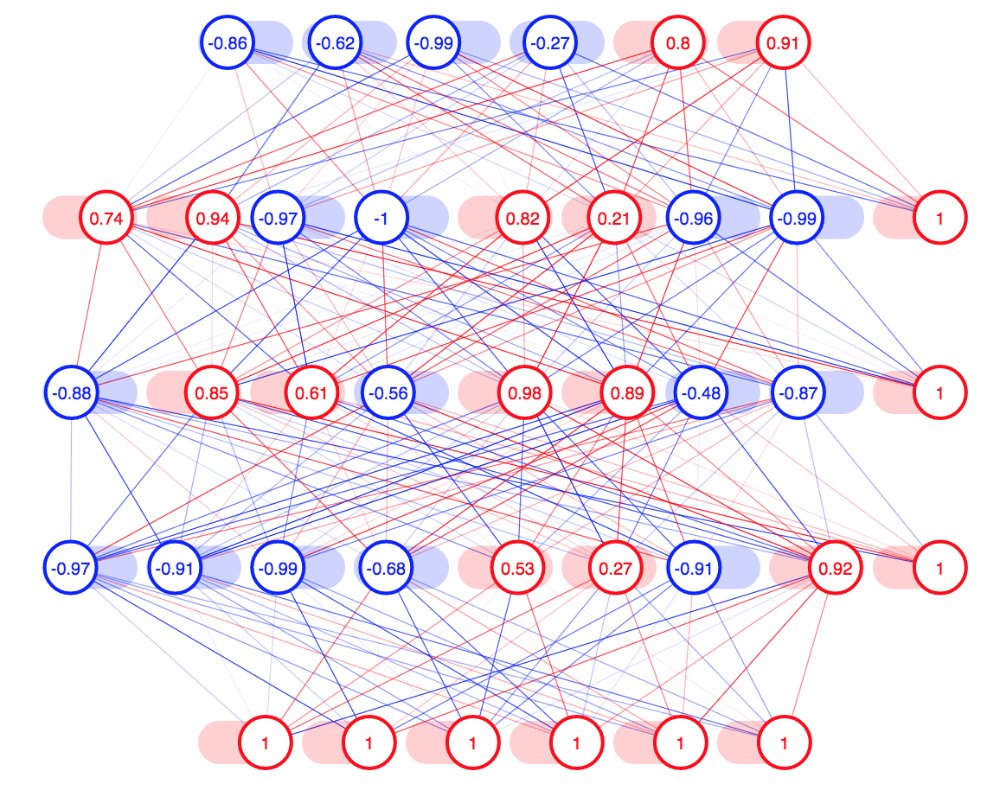

# INTER-NET
Interactive neural network

INTER - NET for short of course!

Download the files and open index.html to play around with it yourself.

Save training examples by double tapping any key on your keyboard.

Hold "t" on your keyboard to train on those examples.

Play with the network architecture and activation functions by using the sliders at the bottom.

Have fun!

Drag nodes to perform backprop! See how neurons effect other neuron's values! 

